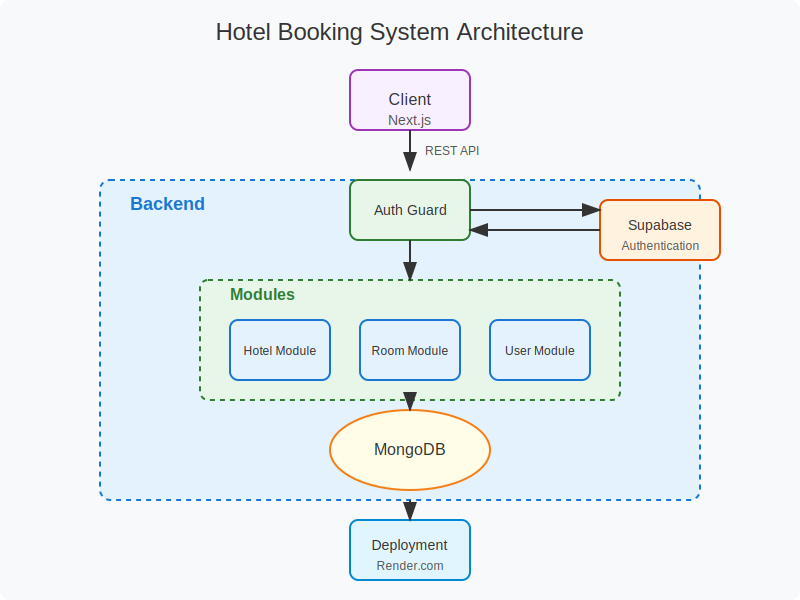

# Hotel Booking System Dashboard

## Installation

Firstly, create your .env file for backend integration.

```command
NEXT_PUBLIC_API_URL="YOUR_BACKEND_SERVICE"
```

Install the dependencies

```command
bun install
```

Start the project on development or production mode.

```command
bun dev
```

## Tech Stack

- Typescript
- Next.js
- React Hook Form & Zod
- Tanstack React Query & Tanstack React Table
- Tailwind & Shadcn
- Zustand

## System Architecture



## Preview

[Live Demo](https://hotel-booking-dashboard-zeta.vercel.app/)
